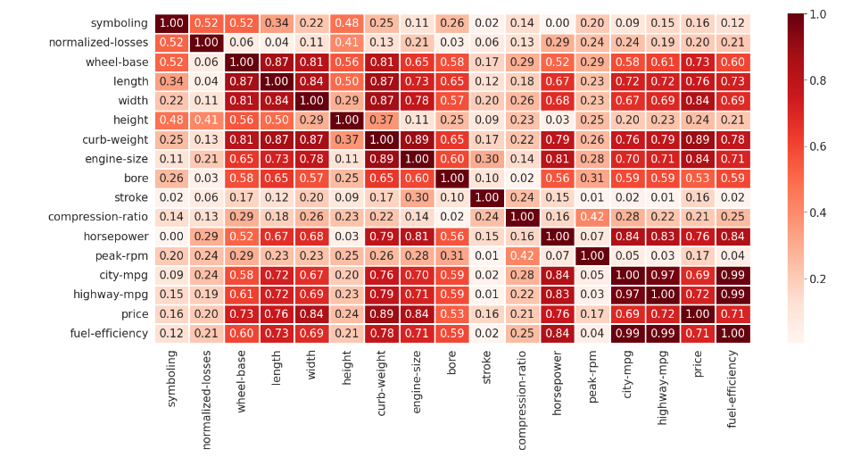

# Automobile Prediction using Machine Learning and Python

## Project Overview
This project delves into the world of automobile insurance risk assessment using a unique dataset from the 1985 Ward's Automotive Yearbook. The data offers a comprehensive picture of various car characteristics, along with assigned insurance risk ratings and normalized loss information and has the potential to be beneficial for both insurance companies and consumers. Insurance companies could utilize the model to refine their risk assessment processes, leading to more accurate pricing. Consumers, on the other hand, could gain valuable insights into the potential insurance costs associated with different cars before making a purchase. The project aims to leverage this data to develop a predictive model. This model will analyze the car's specifications and predict its insurance risk rating and potential losses. 

## Data Sources
The data for this project originates from Unschool, accessed during my basic data science coursework. The dataset is included within this repository 👉[Automobile_data.csv](https://github.com/Thadkapally-Saikiran/Automobile-Prediction/blob/main/Automobile_data.csv)

## Problem Statement
1. Predicting Insurance Risk and Cost
   - Develop machine learning models to predict both categorical insurance risk ratings and continuous average expected insurance prices for various car categories.
2. Understanding Key Risk Factors
   - Identify the most important features from the car data that significantly influence insurance risk ratings and loss patterns. This will help insurance companies understand which car characteristics are most relevant for accurate risk assessment.
3. Machine Learning Exploration
   - Gain practical experience with a variety of popular machine learning algorithms, including Linear Regression, Logistic Regression, Decision Trees, Support Vector Machines, Naive Bayes, K-Nearest Neighbors, and Random Forest. Evaluate the strengths and weaknesses of each algorithm in this specific context.
4. Model Performance Evaluation
   -  Assess the effectiveness of the developed models using appropriate metrics like accuracy, precision, recall, and F1-score. This will help determine the most accurate and reliable model for predicting insurance risk and cost.
5. Data Visualization and Interpretation
   - Create clear and informative visualizations to effectively communicate the findings of the machine learning models. This will help explain the driving factors behind the predicted insurance risk and cost for different car categories.

## Skills/Concepts Demonstrated
1. Data Preprocessing:
   - Data Cleaning Techniques (handling missing values, outliers)
   - Exploratory Data Analysis (EDA) with statistical methods and visualization libraries
   - Data Transformation (scaling, encoding categorical variables)

2. Data Visualization:
   - Libraries like Matplotlib, Seaborn for creating informative visualizations
     - Understanding relationships between features and target variables
   
4. Machine Learning Techniques:
   - Linear Regression (for predicting continuous target variable - price)
   - Logistic Regression (for predicting categorical target variable - risk rating)
   - Decision Trees
   - Support Vector Machines (SVM)
   - Naive Bayes
   - K-Nearest Neighbors (KNN)
   - Random Forest
5. Model Training & Evaluation:
   - Train-Test Splitting
   - Performance Metrics (accuracy, precision, recall, F1-score)

           |       

## Visualization

Correlation Heatmap  
---

## Recommendations

## Project Files
* automobile-prediction.ipynb: Jupyter notebook containing the core analysis and modeling code.
* Data Science- Major Project.pdf: Project background, theoretical context, and detailed methodology explanation.
* Automobile_data.csv: Raw dataset containing car specifications, risk ratings, price and normalized losses etc.
  
This project provides a comprehensive framework for exploring the Automobile_data.csv dataset through predictive modeling, offering valuable learning opportunities and potential for further research and application.

💻 Tech Stack

😃

🧑‍💻

## Thank You! 🖐️
